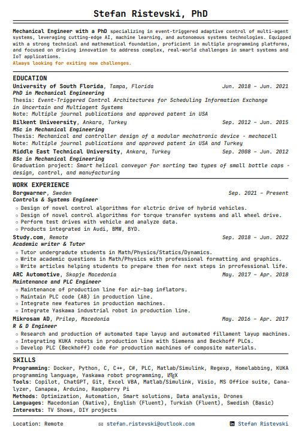

# Modern LaTeX CV Template

A clean, one-page **LaTeX resume template** designed for **industry roles** (data, consulting, strategy).  
Minimalist, structured, and fully customizable — ready to impress recruiters.



---

## ✨ Features

- 🧩 **All-in-one style file** (`resume_integrated.sty`) — keep your `.tex` content-only
- 🎨 **Modern spacing** — 1.1× line height, balanced white space
- 💼 **Industry structure** — Education · Work Experience · Projects · Skills
- 🌍 Unicode-friendly — English + Chinese ready
- 🧰 Works with **pdfLaTeX** or **XeLaTeX**

---

## 📁 Files

| File | Description |
|------|-------------|
| `resume_integrated.sty` | Centralized formatting and commands |
| `cv_template_industry.tex` | One-page industry resume template (Taiwan-flavored) |
| `mock_cv.tex` | Another fictional example |
| `LICENSE` | MIT license (free for personal/commercial use) |

---

## 🚀 Quick Start

```bash
git clone https://github.com/yourusername/modern-latex-cv.git
cd modern-latex-cv
xelatex cv_template_industry.tex   # or: pdflatex cv_template_industry.tex
```

Open `cv_template_industry.tex` and replace the placeholder content with your own.

---

## 🧩 Customize

- **Line spacing**: edit `\linespread{1.1}` inside `resume_integrated.sty`
- **Fonts (XeLaTeX)**:
  ```latex
  \usepackage{fontspec}
  \setmainfont{Times New Roman}
  ```
- **Sections**: duplicate or remove `\headedsection` / `\headedsectiontwo` blocks

---

## 🌟 Tips to Get More Stars

- Include a PDF preview in your repo
- Share on LinkedIn, Reddit r/LaTeX, r/resumes
- Add a tiny footer link in your PDF:
  ```latex
  \begin{center}
    \tiny Template: github.com/yourusername/modern-latex-cv
  \end{center}
  ```

---

## 🧑‍💻 Author

Created by **Ping-Ju Hsieh** updated by **Stefan Ristevski**.
If you like it, please ⭐️ this repository and share! Contributions welcome.

---

## 📜 License

Licensed under the [MIT License](LICENSE).
